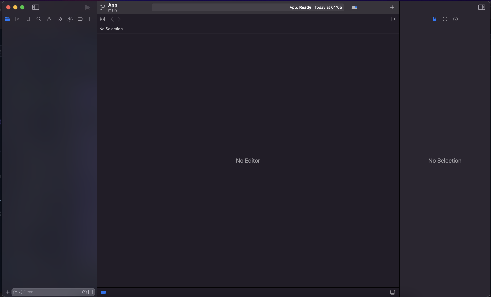
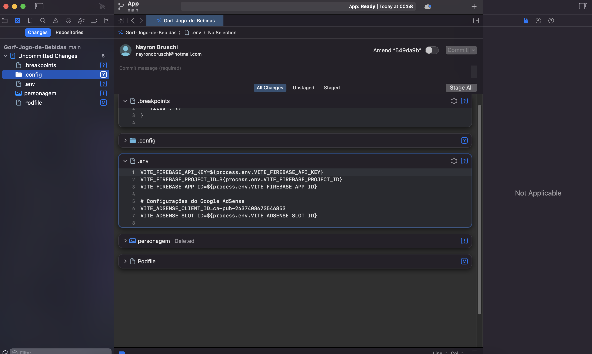
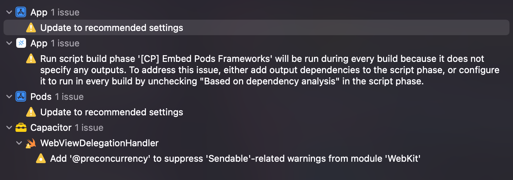

# Guia Visual: Compilação do App Gorf no Xcode

Este guia apresenta os passos visuais para compilar o aplicativo Gorf para iOS usando o Xcode.

## 1. Visão da Interface do Xcode

Ao abrir o projeto no Xcode, você verá uma interface semelhante a esta:



## 2. Estrutura do Projeto

No painel esquerdo, você pode visualizar a estrutura do projeto:



Nesta imagem você pode ver os arquivos principais do projeto, incluindo:
- `.breakpoints`: Configurações de breakpoints para depuração
- `.config`: Arquivos de configuração
- `.env`: Variáveis de ambiente
- `personagem`: Arquivos relacionados aos personagens do jogo
- `Podfile`: Gerenciador de dependências para iOS

## 3. Alertas de Configuração

Durante o processo de compilação, você pode encontrar alertas como este:



Estes alertas indicam configurações recomendadas para o projeto:

1. **App - Update to recommended settings**: Atualizar para configurações recomendadas do App
2. **Pods - Update to recommended settings**: Atualizar para configurações recomendadas dos Pods
3. **WebViewDelegationHandler - Add '@preconcurrency'**: Adicionar o atributo '@preconcurrency' para suprimir avisos relacionados ao 'Sendable' no módulo 'WebKit'

## 4. Passos para Compilação

1. **Abrir o Projeto**:
   ```bash
   npx cap open ios
   ```

2. **Configurar Assinatura**:
   - Selecione o projeto "App" no navegador de projetos
   - Acesse a guia "Signing & Capabilities"
   - Selecione sua equipe de desenvolvimento
   - Certifique-se de que o Bundle ID está configurado corretamente

3. **Resolver Alertas**:
   - Clique em cada alerta e selecione "Fix" para corrigir automaticamente
   - Para o alerta WebViewDelegationHandler, pode ser necessário adicionar manualmente o atributo no código

4. **Executar o Aplicativo**:
   - Selecione um dispositivo no seletor de destino na parte superior
   - Clique no botão de reprodução (triângulo) para compilar e executar

5. **Preparar para Distribuição**:
   - Selecione Product > Archive no menu
   - Siga as instruções para validar e distribuir o aplicativo

## 5. Solução de Problemas Comuns

- **Erros de Compilação**: Verifique se os Pods estão instalados e atualizados
- **Erros de Assinatura**: Certifique-se de que a equipe de desenvolvimento está configurada corretamente
- **Problemas de WebView**: Verifique se as configurações de navegação no `capacitor.config.ts` estão corretas, com `limitsNavigationsToAppBoundDomains: false`

## 6. Próximos Passos

Após a compilação bem-sucedida, siga as instruções detalhadas no arquivo `INSTRUCOES_GORF_APP.md` para distribuir seu aplicativo na App Store.